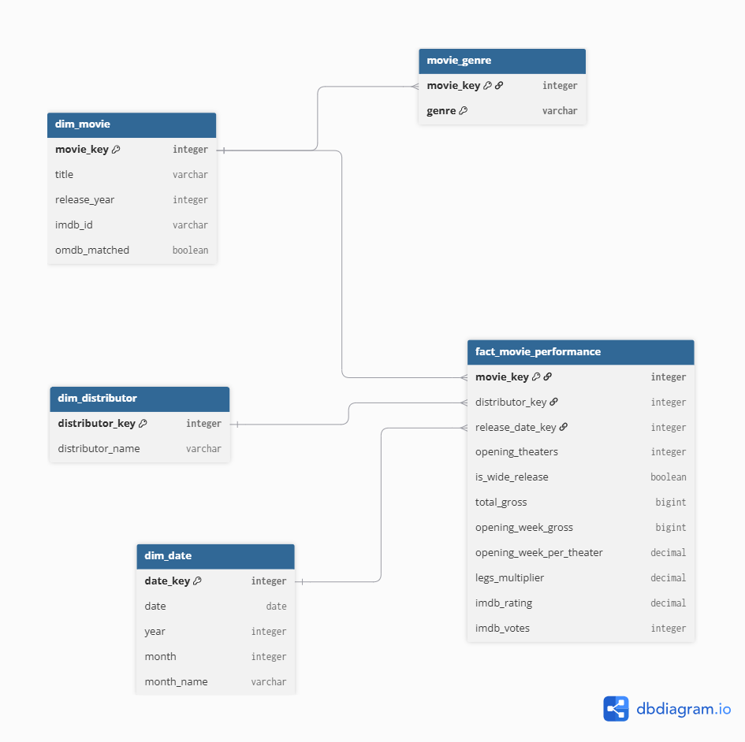

# OMDB_data_product

This document will explain process behind delivering the task and its documentation for the data model.

The **free tier** allows 1000 requests per day, so the project selects a fixed list of 950 movies (see "Movie selection" in section 5) that fits within one day's quota, leaving room for ~50 retries. Dashboard will be built in Streamlit, and will be available to access locally.

## Architecture

The pipeline follows a medallion architecture — bronze, silver, gold — so OMDb is called at most once per movie, no matter how many times the pipeline reruns.

**Tooling:** Python (extract, select, OMDb calls, landing raw data) + dbt-duckdb (staging → gold transformations and tests), both reading/writing one embedded warehouse file, `data/warehouse.duckdb` — no external database server.

| Layer | Contents | Location |
|---|---|---|
| Bronze | Raw CSV as delivered, raw OMDb JSON (one file per movie, full response) — landed as-is into DuckDB's `raw` schema so dbt has sources to build from | `data/bronze/` (files) + `raw` schema in `data/warehouse.duckdb` |
| Silver | Cleaned, typed staging tables — `stg_box_office`, `stg_omdb` — built by dbt staging models | `staging` schema in `data/warehouse.duckdb` |
| Gold | Star schema for the dashboard — `fact_movie_performance`, `dim_movie`, `dim_distributor`, `dim_date`, `movie_genre` — built by dbt marts models | `marts` schema in `data/warehouse.duckdb` |

## 1. Data questions

At first dataset glance we can clearly see a movie release date and its daily revenue in total aggregated theaters it was broadcast. This will allow me to choose a movie total revenue for top 950 movies to fetch data from OMDb to start with.

After the analysis of a movie "I, Robot" found in **data_exploration.ipynb** I decided to build the data product starting from defining data related questions and then defining KPIs for the data which will be presented in the dashboard, once it is defined data model and ingestion can be built:
 
### CSV only
 
| ID | Question |
|---|---|
| Q1 | What were the top 10 movies each year? |
| Q2 | Which distributors had the strongest openings? |
| Q3 | Which movie had the best word of mouth each year? |
| Q4 | Which release month gives the biggest openings? |
| Q5 | How has distributor market share changed over time? |
 
### CSV + OMDb
 
| ID | Question |
|---|---|
| Q6 | What is the top-grossing movie in each genre? |
| Q7 | Which genres earn the most at the box office? |
| Q8 | What was the best-rated movie each year? |
| Q9 | Do higher-rated movies earn more? |
 
---
 
## 2. KPIs
 
| KPI | Definition | Source | Questions |
|---|---|---|---|
| Total gross | sum of daily revenue | CSV | Q1, Q6, Q7, Q9 |
| Opening week gross | revenue in the first 7 days (day 1 = first revenue date) | CSV | Q4 |
| Opening theaters | theaters on the first day | CSV | Q2 (and rule R1) |
| Opening week per theater | opening week gross ÷ opening theaters | CSV | Q2 |
| Legs multiplier | total gross ÷ opening week gross | CSV | Q3 |
| Market share % | distributor's total gross ÷ all movies' total gross, per year | CSV | Q5 |
| IMDb rating | `imdbRating` | OMDb | Q8, Q9 |
| IMDb votes | `imdbVotes` | OMDb | Q8 (via rule R2) |
 
Market share is calculated when the dashboard queries the data, not stored, because its value depends on the active filters.
 
---
 
## 3. Rules
 
| ID | Rule | Why |
|---|---|---|
| R1 | Only wide releases (opening theaters ≥ 600) for Q2, Q3, Q4 | Small releases distort per-theater and legs comparisons |
| R2 | Only movies with ≥ 10,000 IMDb votes for Q8 | Stops a film rated by a few people from winning |
| R3 | Group ratios use sum ÷ sum, not the average of ratios (Q2) | Averaging ratios gives a wrong group value |
| R4 | A movie counts in every genre it has (Q6, Q7) | OMDb genres are multi-valued, so genre totals overlap |
 
---
 
## 4. Data quality checks
 
| Check | Expectation | Why |
|---|---|---|
| One row per movie per date | no duplicates | A duplicate re-ingest would inflate `total_gross` and skew every ranking (Q1, Q3, Q6, Q7) |
| `revenue` and `theaters` | not null, ≥ 0 | Malformed rows would corrupt sums and the wide-release rule (R1) |
| `distributor` | not null and not the placeholder value `"-"` | `"-"` appears in ~2.2% of rows (7,419); left unhandled it would misattribute revenue in Q2/Q5 |
| OMDb `Response` | `"True"`; otherwise the movie is unmatched | Without this, a failed lookup is indistinguishable from a real movie with missing fields |
| OMDb `"N/A"` values | stored as null, not 0 | A `0` rating instead of null would make an unrated movie look like the worst-rated one, breaking Q8/Q9 |
| OMDb match rate | reported (% of CSV movies found in OMDb) | Gives a concrete, checkable number for how trustworthy the enrichment is |
 
---
 
## 5. Sources and pipeline
 
### What to pull from the CSV
 
| Column | Use |
|---|---|
| `date` | release date, opening week, release year and month |
| `title` | movie identity (with release year) |
| `revenue` | total gross, opening week gross |
| `theaters` | opening theaters, wide release rule |
| `distributor` | Q2, Q5 |
 
The CSV has no index column to drop — all 6 columns are named. The `id` column is a unique ID per row, not per movie, so it is used only for the duplicate check. A small number of rows use `"-"` instead of a real value for `distributor`; treat it as null, same as the true nulls in `theaters`/`distributor`.
 
### What to pull from OMDb
 
| Field | Use |
|---|---|
| `imdbID` | unique movie key from OMDb |
| `Title`, `Year` | check that the match is the right movie |
| `Genre` | Q6, Q7 |
| `imdbRating` | Q8, Q9 |
| `imdbVotes` | rule R2 |
| `Response`, `Error` | detect failed lookups (section 4) |
 
`Response`/`Error` aren't stored as-is — they collapse into two derived columns, `omdb_matched` (bool) and `error_message` (null when matched). The request also carries `requested_title`/`requested_year` (from the selected movie list) alongside the response, so `Title`/`Year` can actually be checked against what was asked for, not just displayed.
 
### Movie selection
 
As a proof of concept, this project's warehouse holds 950 movies. The limit comes from the API: the free OMDb key allows 1,000 requests per day, so 950 lookups fit in one day, leaving room for ~50 retries.
 
- **Movie identity:** title + year of the first revenue date (titles repeat for remakes).
- **Selection rule (proposed):** top 95 movies by total gross per year, for the 10 most recent complete years in the CSV. This keeps years balanced for the per-year questions (Q1, Q3, Q8).
- **Selection happens before any API call**, so OMDb is called only for the chosen movies.
- **Failed lookups** are kept as unmatched (`omdb_matched = false`) and counted in the match rate.

### Pipeline order
 
1. **Extract** *(Python)*: read the full CSV.
2. **Aggregate** *(Python)*: one row per movie (title + release year) with total gross.
3. **Select** *(Python)*: apply the selection rule and save the list of 950 movies.
4. **Call OMDb** *(Python)*: one request per selected movie; save the raw JSON to bronze; log failures.
5. **Load raw** *(Python)*: write the selected CSV rows and the raw OMDb fields into DuckDB's `raw` schema, unmodified — this is dbt's source data.
6. **Stage** *(dbt)*: staging models clean and type the raw tables into `stg_box_office`/`stg_omdb` — fix types, convert `"N/A"`/`"-"` to null, parse `imdbVotes` ("611,841" → 611841).
7. **Build marts** *(dbt)*: mart models join staging on title + release year and build the gold tables from section 6.
8. **Test** *(dbt)*: dbt tests implement the section 4 checks (uniqueness, not-null, match rate) directly against staging and marts.
---
 
## 6. Data model
 
### Staging (silver layer)
 
One table per source.
 
| Table | One row per | Purpose |
|---|---|---|
| `stg_box_office` | movie × date | cleaned CSV rows |
| `stg_omdb` | movie | parsed OMDb fields |
 
### Star schema (gold layer)
 
One fact table (the measures) plus dimensions (the descriptive attributes) — the dashboard is the consumer of it.
 
| Table | Type | One row per | Purpose |
|---|---|---|---|
| `fact_movie_performance` | fact | movie | revenue and rating measures for the dashboard |
| `dim_movie` | dimension | movie | movie identity |
| `dim_distributor` | dimension | distributor | distributor name |
| `dim_date` | dimension | calendar date | release date, year, month |
| `movie_genre` | bridge | movie × genre | genre questions (Q6, Q7) — genre is multi-valued, so it can't sit on `dim_movie` as a single column |
 
Full column definitions, keys, relationships, and design notes (fact grain, denormalization choices) live in `data_model.dbml` (dbdiagram.io) rather than here, so the schema has one searchable, diffable source of truth instead of duplicating it in prose.

 
---